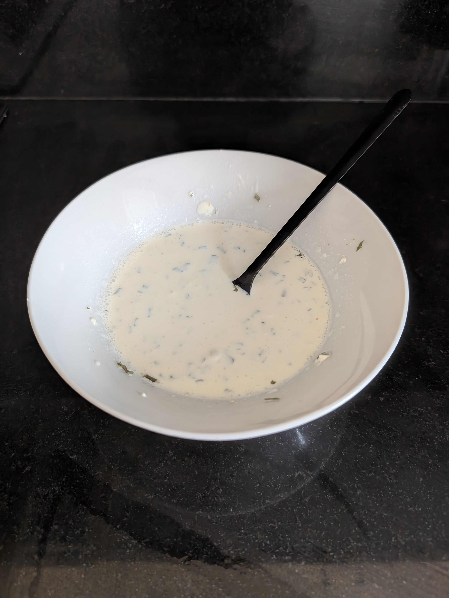

---
tags:
  - sauce
aliases:
category:
country:
duration_min:
todo: false
acknowledgements:
links:
theme: tre_light
marp: false
paginate: false
---

# Sour Cream Sauce

|Ingredient|Amount (4 portions)|
| :- | :- |
|sourcream [g]|240|
|milk [mL]|30|
|chive [g]|3|
|garlic powder [g;tsp]|0.5|
|salt [g;tsp]|0|

## Recipe

1. combine  **sourcream**, **garlic powder**, **chives**, **onion powder**, **salt**
2. stir well
3. gradually add **milk** until desired viscosity reached

## Notes
