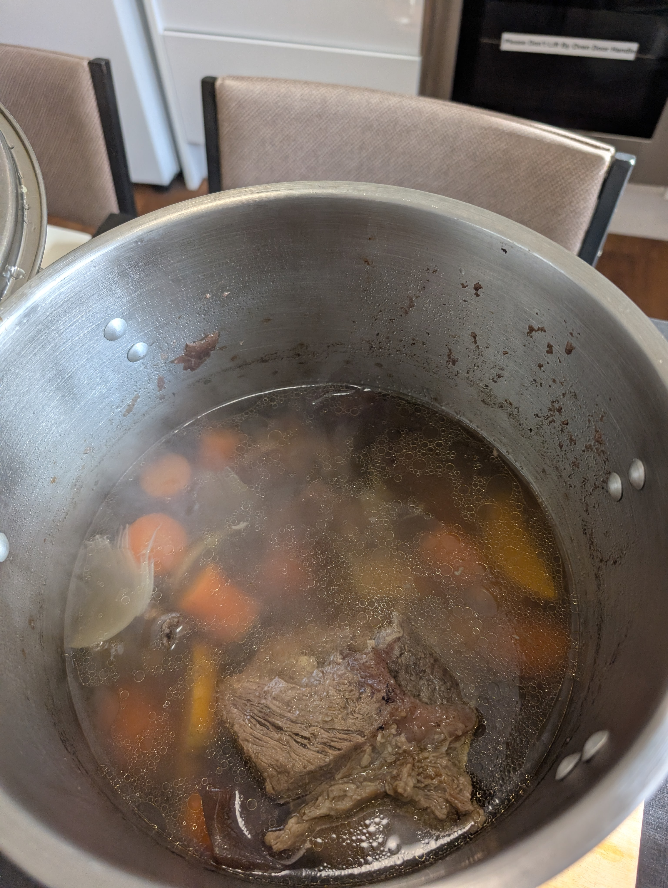
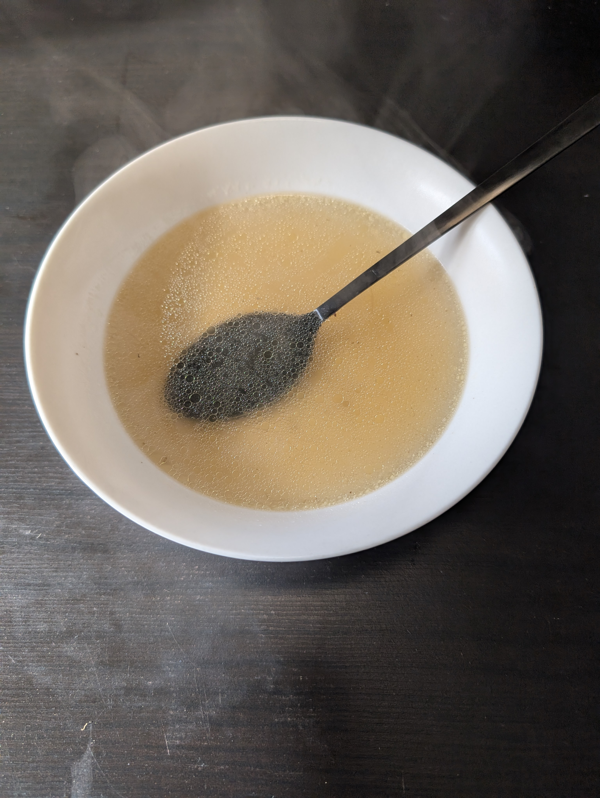

---
tags:
  - soup
category:
  - cooking
country: 
duration_min: 
todo: false
theme: tre_light
marp: false
paginate: false
aliases:
  - Rindsuppe
acknowledgements:
  - Oma Berni
links:
---

# Rindsuppe

|Ingredient|Amount (4 portions)|
| :- | :- |
|water|2000 mL|
|beef bones|660 g|
|meat (beef)|660 g|
|bay leaf|1|
|onion|1|
|soup vegetables|1|
|juniper berries|0|
|pepper|0|
|salt|0|

## Recipe

1. peel and cut **onion** in half
	1. leave innermost brown skin on (for color of soup)
2. heat big pot in dry state
3. place **onion** with cutting area down in the hot pot
	1. roast until almost dark-brown
4. dry **meat (beef)**, **beef bones** with paper towel
5. add **meat (beef)** into hot pot
	1. roast for short time
6. add cold **water** to pot
7. add **beef bones**, **soup vegetables**, **pepper**, **juniper berries**, **bay leaf**
	1. make sure **meat (beef)** is covered with **water**
8. add peel of **onion**
	1. to make sure soup stays clear
9. let cook on low heat for $2\,h$ (cover with lid!)
	1. skim foam every now and again with spoon
	2. Make sure **meat (beef)** is soft
10. about $1.45\,h$ in season with **salt**, **pepper**
	1. do not season earlier because otherwise **meat (beef)** will be dry
11. filter through sieve if you wish

## Notes
1. for serving use a soup content of your choice
	1. [Frittaten](Frittaten.md) => [Frittatensuppe](Frittatensuppe.md)
	2. [Griessnockerl](Griessnockerl.md) => [Griessnockerlsuppe](Griessnockerlsuppe.md)
	3. bite-sized pieces of [Tafelspitz](Tafelspitz.md) (cooked **meat (beef)**) => [Tafelspitzsuppe](Tafelspitzsuppe.md)
