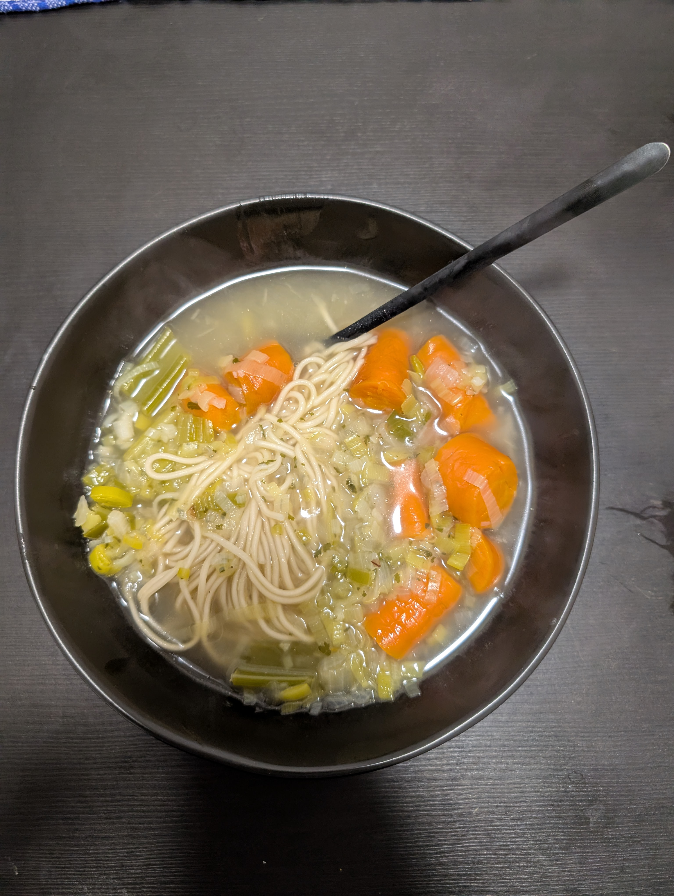

---
tags:
  - soup
category: cooking
country:
duration_min:
todo: false

theme: tre_light
marp: false
paginate: false
---

# Vegetable Soup

## Ingredients

## Recipe
1. peel and chop **onion**
1. roast **onion** in big pot with **oil** until transparent
1. add **water** and let boil up once
1. clean and chop **carrot**, **leek**, **celery**, **parsley**
    1. add to broth
    1. add **bay leafs**, **juniper berries**
1. let **broth** simmer until the vegetables become nice and soft
    1. don’t close lid entirely
1. season to taste with **salt**, **pepper**, (**soup seasoning**)

## Notes
* [https://www.gutekueche.at/gemuesesuppe-rezept-8768](https://www.gutekueche.at/gemuesesuppe-rezept-8768)

