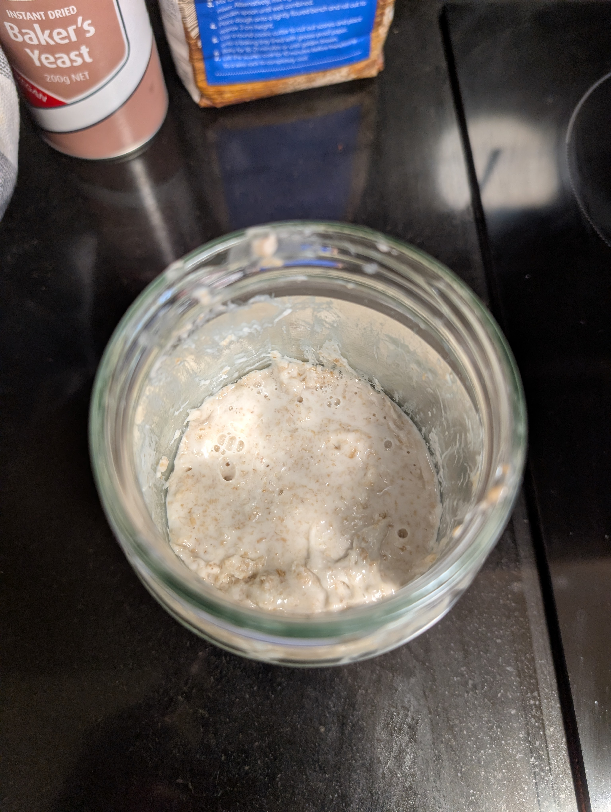
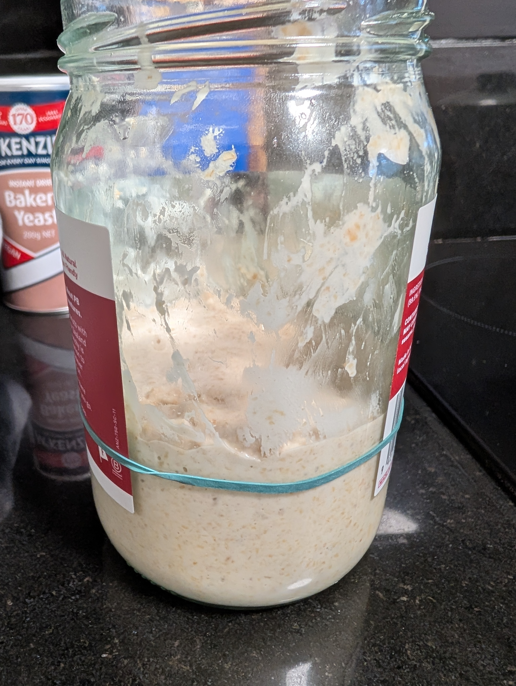

---
tags:
  - base
  - baking
aliases:
category:
country:
duration_min:
todo: false
acknowledgements:
  - Reiner Schmidt
links:
  - https://natashaskitchen.com/sourdough-starter-recipe/
theme: tre_light
marp: false
paginate: false
---

# Sourdough Starter

|     |     |
| :-: | :-: |
|||

|Ingredient|Amount (4 portions)|
| :- | :- |
|flour (rye) | 50 g |
|water (room temperature) | 50 g |
|rubber band | 1 |

## Recipe

### Day 1
1. record
	1. date and time of starter creation
	2. weight of jar hosting the starter
	3. amount for feeding (equivalent to initial parts)
	4. type of **flour** used
2. inside the jar mix $\pu{50g}$ **flour (rye)** with $\pu{50g}$ **water (room temperature)**
	1. combined mixture should be thick
3. scrape sides of jar to keep things clean
4. cover with *loose-fitting* lid
5. mark height of starter with **rubber band**
6. let sit for $\pu{12h}$
7. stir once
8. let sit for another $\pu{12h}$

### Raising the Starter
1. check starter daily at around the same time

#### No Change (Usually Day 2)
1. let sit for $\pu{24h}$

#### Visible Bubbles + Doubled in Size (Usually Day 3)
1. discard half of the starter instead of the amount shown in [Feeding](#Feeding)
2. [Feeding](#Feeding)

#### Lots of Bubbles (Usually Day 4)
1. [Feeding](#Feeding)

#### Bubbles + Some Growth (Usually Day 5)
1. [Feeding](#Feeding)

#### Doubling in Size (Usually Day 6-7)
1. [Feeding](#Feeding)
	
### Baking Readiness Tests
1. starter doubles in $\pu{4h}-\pu{6h}$ and begins to recede after $\pu{12h}$
2. starter smells sour
3. starter has bubbles
4. starter has dome-shaped top layer
5. starter floats in bowl of water
		
### Feeding
1. discard all *BUT* $\pu{100g}$ of the starter
2. feed with equal parts ($\pu{50g}$ each) of **flour (rye)** and **water (room temperature)**
3. mix well
4. scrape down the side
5. cover with loose-fitting lid
6. adjust **rubber band**
7. let rest for $\pu{24h}$

## Keeping the Dough Starter Alive
### Option 1
1. keep in fridge to suppress activity
2. [Feeding](#Feeding) once a week
	1. let sit at room temperature for $\pu{1h}-\pu{2h}$ before refrigerating again

### Option 2
1. [Feeding](#Feeding) always should be done with the same type of **flour** that you used in the beginning
2. [Feeding](#Feeding) with same amount that is currently present divided equally between **flour (rye)** and **water (room temperature)**
	1. i.e., for $\pu{100g}$ of dough starter feed with $50g$ **water (room temperature)** and $50g$ **flour (rye)**
3. [Feeding](#Feeding) has to be done every $\pu{12h}-\pu{24h}$
	* warmer homes closer to $\pu{12h}$
	* colder homes closer to $\pu{24h}$
* when using for baking allow the sourdough starter to sit for $\pu{4h}-\pu{12h}$ after [Feeding](#Feeding)

## Preserving Part of the Starter
1. only works once starter is mature
2. separate $\pu{100g}$ (that you would discard at [Feeding](#Feeding)) and put in fridge
3. when needed 
	1. feed once 
	2. let sit for $\pu{12}-\pu{24h}$ (reactivation) 
	3. use as usual
4. if you're lucky and have a strong stater, it might even survive for a few months in the fridge

## Notes
* if you tend to bake in the morning, it is good to initialize and feed your starter in the evening
	* this way it reaches just after its maximum after feeding when you're ready to bake (see [Option 2](#Option%202))
* good alternatives for **flour (rye)**
	* **flour (wheat)**
	* **flour (wholemeal)**
	* other types work as well, but might take longer
* some things that might enhance your experience
	* diastatic malt powder (supposed to enhance crunchiness of crust)
	* cast-iron pot for baking (oven compliant)