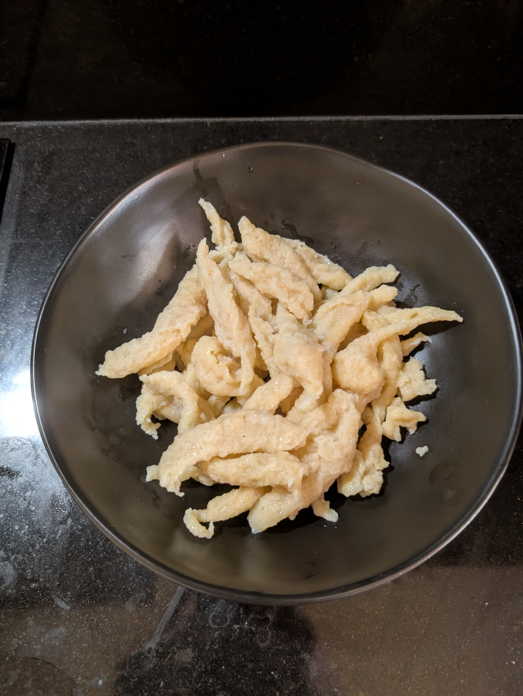

---
tags:
  - base
todo: false
country:
  - austria
category:
  - cooking
duration_min: 30
theme: tre_light
marp: false
paginate: false
aliases: 
acknowledgements: 
links:
---

# Spätzle

|Ingredient|Amount (4 portions)|
| :- | :- |
|flour|300 g|
|milk|150 mL|
|butter|50 g|
|egg|3|
|salt|0.4 g|
|water|-|

## Recipe
1. melt **butter**
1. mix with **milk**, **salt**, **eggs**
1. mix in **flour**
    1. add **milk** if dough is to viscous
1. boil salted **water** in pot
    1. add dough via
        1. spätzle-sieb
        1. cutting board and knive
    1. take dough out of **water** when swimming to surface

### Cutting Board and Knive
1. with a spatula take some of the dough from the bowl and spread it close to the edge of the cutting board 
    1. close to, NOT at the edge
1. pick up the cutting board in one hand and a knive in the other
1. place the back of the knive in the spread dough close to the edge
    1. you want to have the back aligned flat with the cutting board
1. slide towards the edge of the board
    1. dough will glide along and form cylinder-like strand
1. let strand drop into boiling water
1. repeat until all the dough is cooked

> it helps if you dip the blade of your knife in the boiling water and splash some of the boiling water onto the cutting board
## Notes
