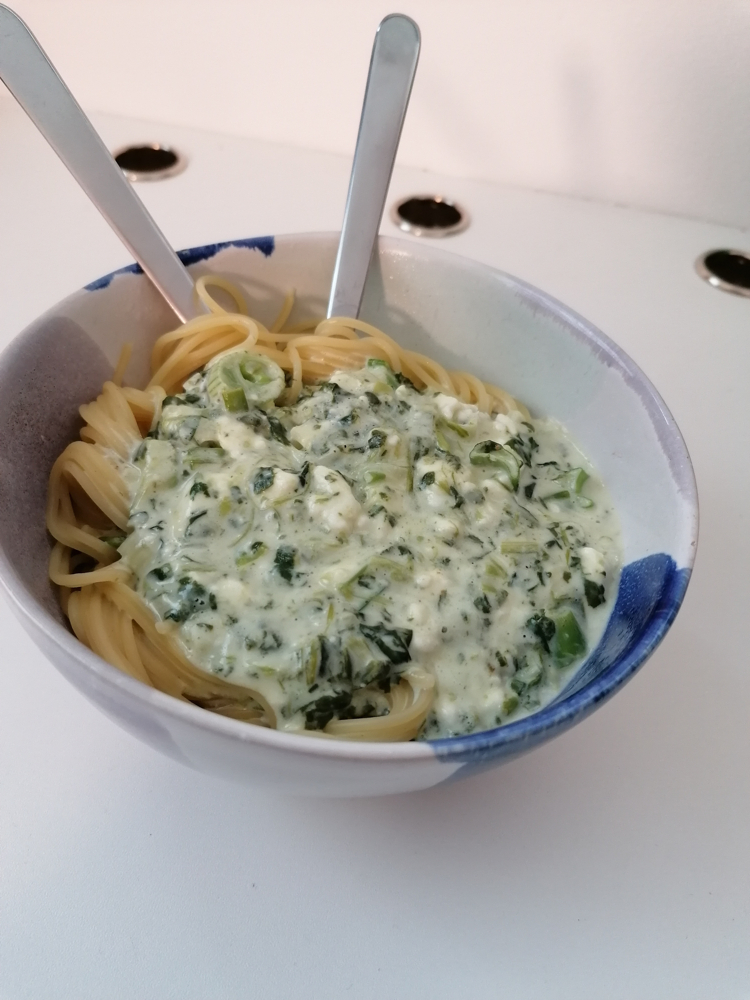

---
tags:
  - pasta
category: cooking
country:
duration_min:
todo: false

theme: tre_light
marp: true
paginate: false
---

# Spaghetti agli Spinaci

---
## Ingredients

## Recipe
1. prepare [pasta](Pasta.md)
1. roast **onion**, **garlic** in a bit of **oil**
1. add (frozen) **spinach**
    1. to unfreeze/evaporate water
1. fill up with **cream**
1. once it came to a boil add **feta cheese**
1. season with **salt**, **pepper**, **tumeric**, **lemon**, (**green goddess seasoning blend**)
    1. (can be substituted with **soup seasoning**)

## Notes

