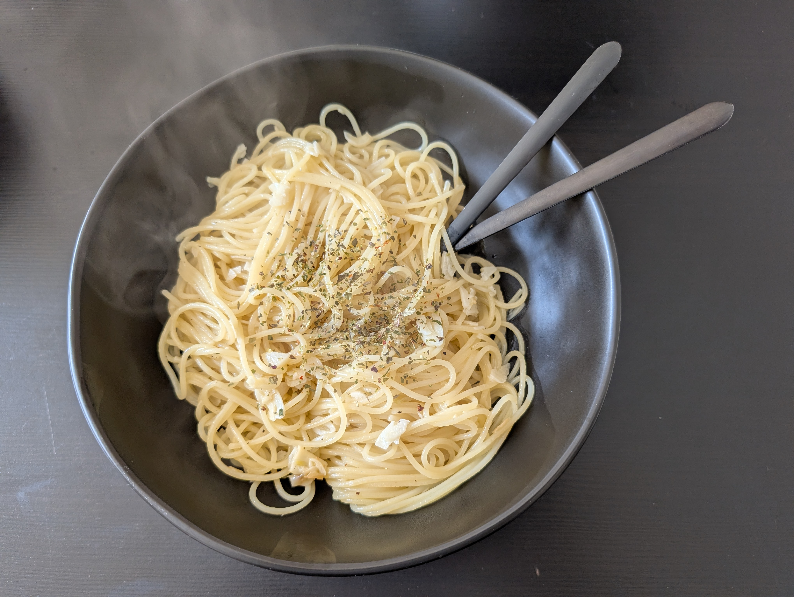

---
tags:
  - pasta
category:
  - cooking
country:
  - italy
duration_min: 
todo: false
theme: tre_light
marp: false
paginate: false
aliases: 
acknowledgements: 
links:
  - https://www.gutekueche.at/spaghetti-aglio-e-olio-rezept-37
---

# Spaghetti Aglio E Olio

|Ingredient|Amount (4 portions)|
| :- | :- |
|pasta|500 g|
|garlic|20 cloves|
|salt|-|
|oil|-|
|parsley|-|
|water|-|

## Recipe
1. cook [pasta](Pasta.md)
2. finely chop **garlic**, **parsley**
3. roast **garlic** and **parsley** in **oil (olive)**
4. once [pasta](Pasta.md) is done, add to pan
    1. swirl [pasta](Pasta.md) around until everything is covered in sauce (oil)

## Notes

