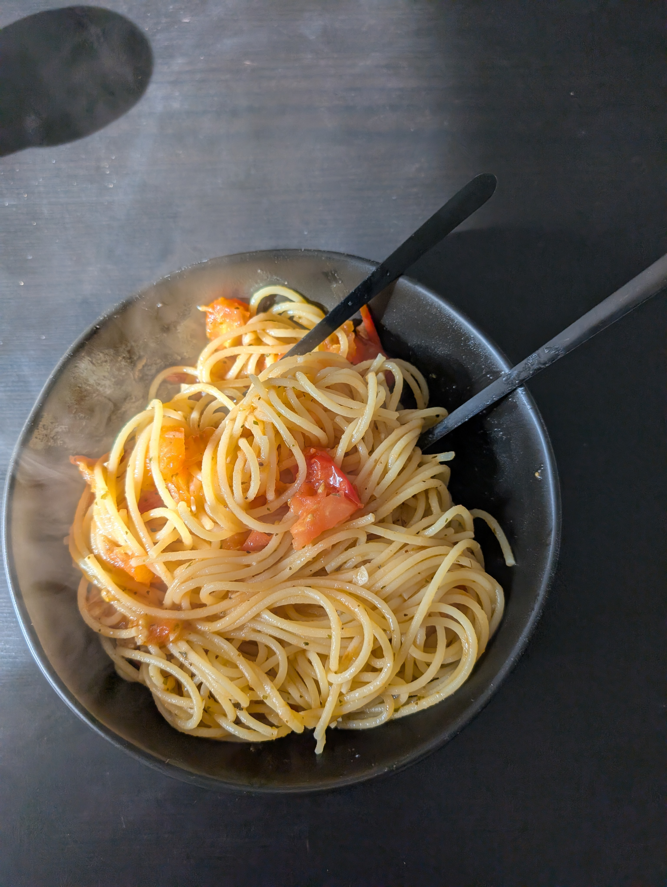

---
tags:
  - pasta
category:
  - cooking
country: 
duration_min: 
todo: false
theme: tre_light
marp: false
paginate: false
aliases: 
acknowledgements: 
links:
---

# Spaghetti Aglio E Pomodoro

|Ingredient|Amount (4 portions)|
| :- | :- |
|tomato|800 g|
|pasta|500 g|
|garlic|20 cloves|
|italian herbs seasoning blend|-|
|oil (olive)|-|
|parsley|-|
|salt|-|
|water|-|

## Recipe
1. cook [pasta](Pasta.md)
1. finely chop **garlic**
1. heat **oil (olive)** in pan
1. add **garlic**
    1. briefly roast
1. add **tomato**
1. add **salt**
    1. to make **tomato** pop open and get the juice out
    1. should lead to thick sauce
1. add **basil**
1. add **pasta water**
    1. to make nice and creamy
1. season with **salt**, **italian herbs** seasoning blend
1. add [pasta](Pasta.md)
1. mix well

## Notes

