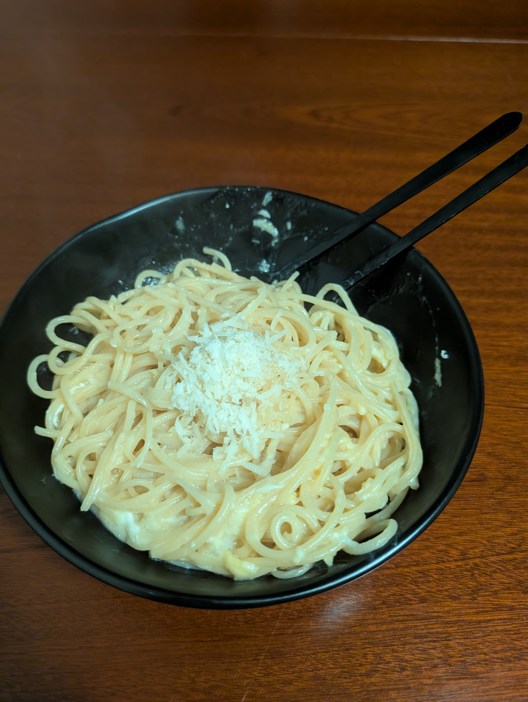

---
tags:
  - pasta
category:
  - cooking
country: 
duration_min: 
todo: false
theme: tre_light
marp: false
paginate: false
aliases: 
acknowledgements: 
links:
  - https://catslovecooking.wordpress.com/2011/05/18/jamie-oliver-lemon-linguine/
---

# Spaghetti al Lemone

|Ingredient|Amount (4 portions)|
| :- | :- |
|pasta|500 g|
|parmesan|125 g|
|oil (olive)|88 mL|
|lemon|3|
|egg|2|
|basil|-|
|pepper|-|
|salt|-|
|water|-|

## Ingredients
## Recipe
1. grate **lemon** to get zests
1. squeeze **lemon** to get juice
1. prepare [pasta](Pasta.md)
1. sauce
    1. beat **lemon** juice, **lemon** zest, **oil (olive)**, **egg**, **parmesan** until creamy
        1. season with **salt**, **pepper**
1. add sauce to [pasta](Pasta.md)
1. mix in chopped **basil**

## Notes
