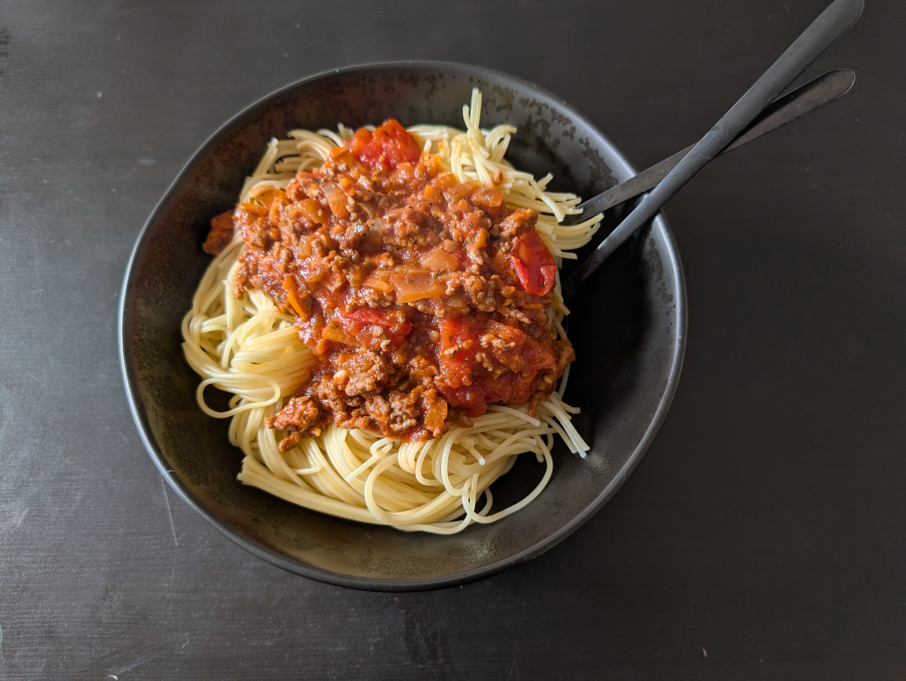

---
tags:
  - pasta
category:
  - cooking
country:
  - italy
duration_min: 
todo: false
theme: tre_light
marp: false
paginate: false
aliases:
  - Spaghetti Bolognese
acknowledgements: 
links:
---

# Spaghetti al Ragu

|Ingredient|Amount (4 portions)|
| :- | :- |
|pasta|500 g|
|tomato-sauce|400 mL|
|minced meat|350 g|
|garlic|2 cloves|
|tomato paste|2 tbsp|
|carrot|1|
|salt|1|
|oil|-|
|water|-|
|pepper|-|
|italian herbs seasoning blend|-|
|marjoram|-|
|wine (red)|-|

## Recipe
1. chop ***onion***, **garlic**
2. prepare [tomato sauce](./SauceTomato.md)
    1. alternatively use canned **tomato sauce**
3. cut/grind **carrot**
4. prepare [pasta](Pasta.md)
5. roast **onion**, **garlic**
    2. add **carrot**
6. add **minced meat**
    3. roast until well done
7. add
    4. [tomato sauce](./SauceTomato.md)
    5. **wine**
        1. can be substituted with [soup](./Soup_Vegetables.md)
8. close lid
    6. let simmer at low heat for ~30min
9. add **tomato puree** if necessary
10. season with **italian herbs**, **marjoram**, **salt**, **pepper**, **basil** as you go

<!-- ### Alternative (no canned tomato sauce)
1. prep
    1. chop **onion**, **garlic**, **basil**
    2. chop **tomato**
        1. season with **salt**, **basil**
            1. **salt** to make sure tomatoes soften and excrete their sauce
    3. cut/grind **carrot**
2. the meat
    4. in pan roast onions, garlic
        2. add carrots
    5. add minced meat
        3. roast until well done (season with salt, pepper, marjoram on the go)
    6. put cooked contents aside
3. the tomato-sauce
    7. boil spaghetti in pot
    8. add oil to pan
        4. add tomatoes
        5. let simmer on medium heat until tomatoes start to soften
            2. (help to soften by squeezing with cooking spoon if necessary)
    9. add pasta water to pan
        6. (will yield creamy sauce due to starch)
    10. let simmer until a creamy sauce with tomato chunks emerges
4. marrying the parts
    11. add the meat to the pot and mix thoroughly
    12. wine (can be substituted with soup)
    13. season as you go
    14. close lid
        7. let simmer at low heat for ~30 min
    15. season with italian herbs, marjoram, salt pepper, basil on the go
5. (add tomato puree if necessary) -->

## Notes

