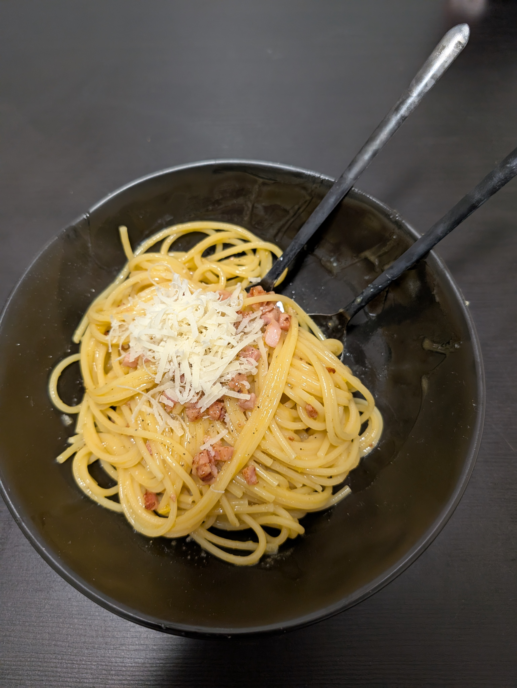

---
tags:
  - pasta
category:
  - cooking
country:
  - italy
duration_min: 
todo: false
theme: tre_light
marp: false
paginate: false
aliases: 
acknowledgements: 
links:
---

# Spaghetti Carbonara

|Ingredient|Amount (4 portions)|
| :- | :- |
|pasta|500 g|
|egg|4|
|bacon cubes|-|
|parmesan|-|
|pepper|-|
|salt|-|
|water|-|

## Recipe
1. prepare [pasta](Pasta.md)
2. mix **egg** yolks, **parmesan**, **pepper**, **salt**
    1. whisk until uniform mass
3. roast **bacon cubes** in pan
4. add [pasta](Pasta.md)
5. add sauce
    1. make sure everything is covered in sauce
6. don’t leave on stove for too long (sauce shall be slightly moist)

## Notes

