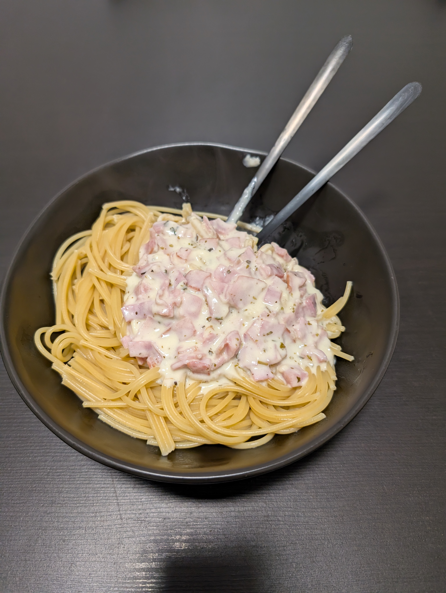

---
tags:
  - pasta
category:
  - cooking
country: 
duration_min: 
todo: false
theme: tre_light
marp: false
paginate: false
aliases: 
acknowledgements: 
links:
---

# Spaghetti mit Schinken-Rahm Sauce

|Ingredient|Amount (4 portions)|
| :- | :- |
|pasta|500 g|
|bacon cubes|-|
|ham|-|
|cream|-|
|onion|-|
|parmesan|-|
|water|-|

## Recipe
1. prepare [pasta](Pasta.md)
2. chop **onion**
3. cut **ham** into small pieces
4. sauce
    1. roast **onion** in pan
    2. add **ham** to roast alongside for a short amount of time
    3. add **cream**
    4. add **cheese (hard)**
        1. blend everything together
    5. season with **salt**, **pepper**, **rosemary**, (**provence seasoning blend**)
5. marry [pasta](Pasta.md) and sauce

## Notes

