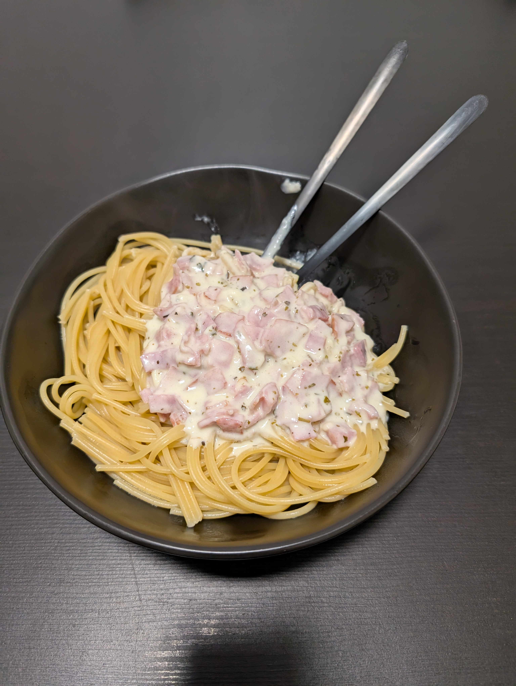

---
tags:
  - pasta
category:
  - cooking
country:
duration_min: 30
todo: false
theme: tre_light
marp: false
paginate: false
aliases:
acknowledgements:
  - Daniela Steinwender
links:
---

# Spaghetti mit Schinken-Rahm Sauce

|Ingredient|Amount (4 portions)|
| :- | :- |
|pasta|500 g|
|cream|300 mL|
|ham|200 g|
|onion|1|
|oil (olive)|-|
|parmesan|-|
|pepper|-|
|rosemary|-|
|salt|-|
|thyme|-|

## Recipe
1. prepare [pasta](Pasta.md)
2. finely chop **onion**
3. dice **ham** into small pieces
4. sauce
    1. heat **oil** in pan (medium heat)
    2. roast **ham**
	3. add **onion** in pan
    4. add **cream** (reduce heat to low)
    5. add **parmesan**
        1. blend everything together
    6. season with **salt**, **pepper**, **rosemary**, (**provence seasoning blend**)
5. marry [pasta](Pasta.md) and sauce

## Notes
* **ham** can be substituted by **bacon cubes**
