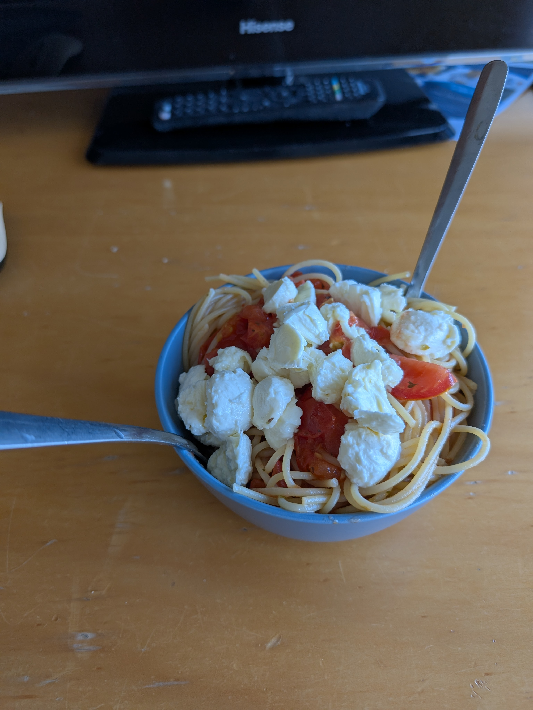

---
tags:
  - pasta
category:
  - cooking
country: 
duration_min: 
todo: false
theme: tre_light
marp: false
paginate: false
aliases: 
acknowledgements: 
links:
---

# Spaghetti Tomato e Mozzarella

|Ingredient|Amount (4 portions)|
| :- | :- |
|tomato|1000 g|
|pasta|500 g|
|mozzarella|250 g|
|basil|-|
|italian herbs seasoning blend|-|
|oil (olive)|-|
|salt|-|
|water|-|

## Recipe
1. prepare [pasta](Pasta.md)
1. prepare [tomato sauce](./SauceTomato.md)
    1. make sure to have significant amount of **tomato** chunks left in the sauce!
1. add [pasta](Pasta.md) to pan
    1. mix thoroughly
1. turn off heat
1. add **mozzarella**
    1. mix thoroughly until **mozzarella** is slightly molten

## Notes

