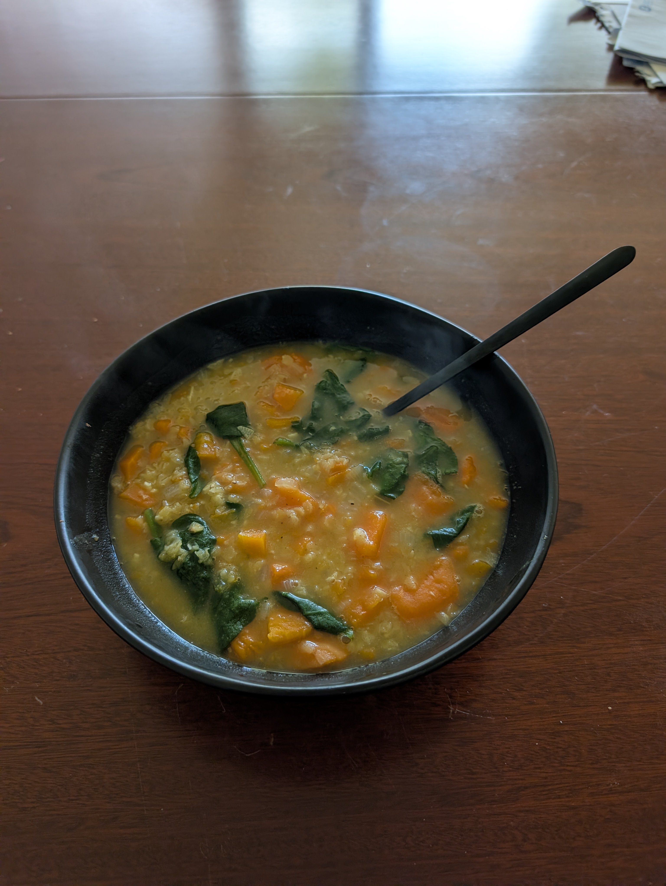

---
tags:
  - soup
aliases:
country:
duration_min: 90
todo: false
acknowledgements:
links:
  - https://www.acouplecooks.com/sweet-potato-lentil-soup/#tasty-recipes-168565-jump-target
theme: tre_light
marp: false
paginate: false
---

# Sweet-Potato Lentil Soup

|Ingredient|Amount (6 portions)|Alternative Units|
| :- | :- | :- |
|water|2000 mL|
|lentils (red)|450 g|
|spinach|250 g|
|coconut milk|180 mL|
|oil (olive)|45 mL|
|garlic|3|
|celery|2|
|sweet potatoes|2|
|salt|1.5 tbsp|
|cumin|1 tbsp|
|onion|1|
|curry powder|0.5 tbsp|
|pepper|0 g|

## Recipe

1. finely chop **onion**, **garlic**, **celery**, **carrot**
2. dice **sweet potatoes**
3. heat **oil** in large pot
	1. medium heat
4. add **onion**, **garlic**, **celery**, **carrot**
	1. saute for $\approx 5\,\mathrm{min}$
	2. until tender
5. add **sweet potatoes**, **water**, **lentils**, **cumin**, **curry powder**, **salt**
6. let simmer for $\approx 30\,\mathrm{min}$
	1. until **lentils** are tender
7. add **spinach**, **coconut milk**
8. stir until **spinach** wilted
9. season to taste with **salt**, **pepper**

## Notes
* works very well together with [BreadCroutons](BreadCroutons.md)
* you can substitute **spinach** with other greens
* freezes well ($\approx 3\,\mathrm{months}$)
* lasts $\approx 1\,\mathrm{week}$ in the fridge