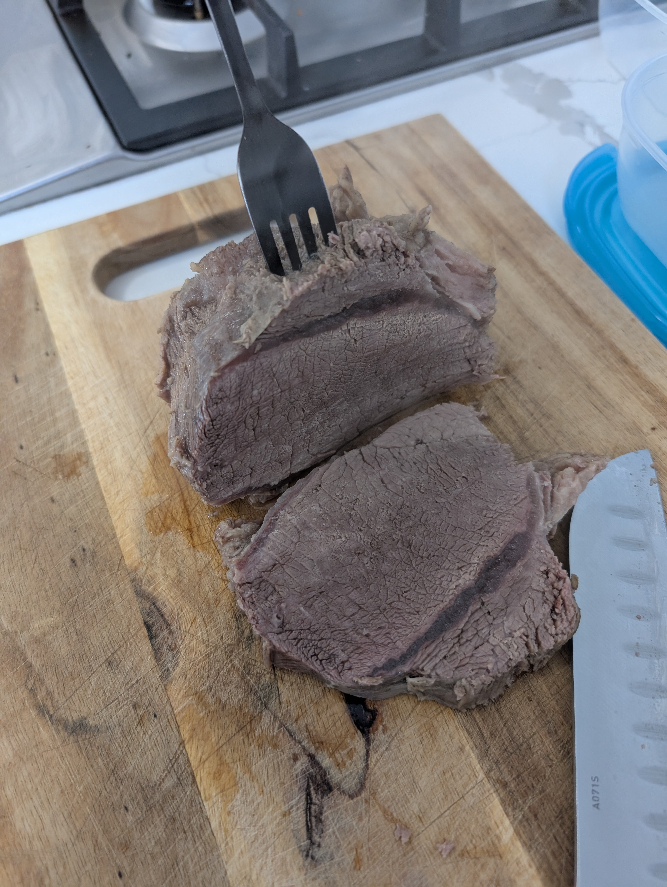
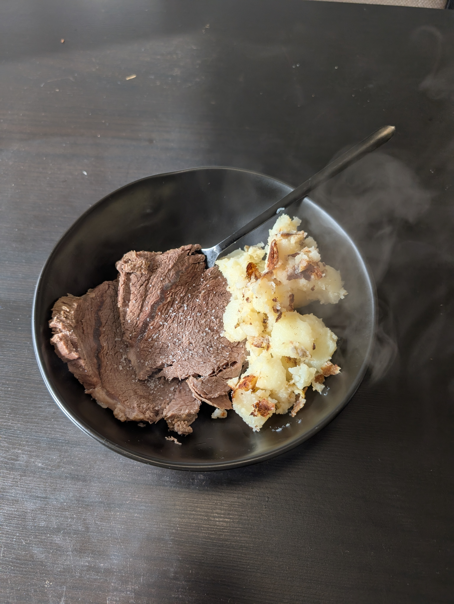

---
tags:
  - meat
category:
  - cooking
country:
  - austria
duration_min: 
todo: false
theme: tre_light
marp: false
paginate: false
aliases: 
acknowledgements:
  - Oma Berni
links:
---

# Tafelspitz

|Ingredient|Amount (4 portions)|
| :- | :- |
|water|2000 mL|
|beef bones|660 g|
|meat (beef)|660 g|
|bay leaf|1|
|onion|1|
|soup vegetables|1|
|juniper berries|0|
|pepper|0|
|salt|0|

## Recipe
1. prepare [Rindsuppe](Soup_Beef.md)
	1. extract **meat (beef)** from [Rindsuppe](Soup_Beef.md)

## Sides
*  traditionally served with [Potato_Roasted](Potato_Roasted.md), **Horseradish**, [CreamSpinach](CreamSpinach.md)

## Notes

