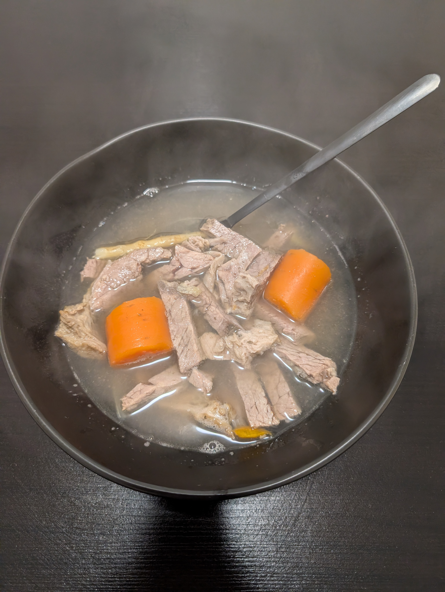

---
tags:
  - soup
  - tradition
aliases:
category:
  - tradition
country:
  - austria
duration_min:
todo: false
acknowledgements:
  - Oma Berni
links:
theme: tre_light
marp: false
paginate: false
---

# Tafelspitzsuppe

|Ingredient|Amount (4 portions)|
| :- | :- |
|water|2000 mL|
|beef bones|660 g|
|meat (beef)|660 g|
|bay leaf|1|
|onion|1|
|soup vegetables|1|
|juniper berries|0|
|pepper|0|
|salt|0|

## Recipe
1. prepare [Soup_Beef](Soup_Beef.md)
2. cut a slice of the resulting [Tafelspitz](Tafelspitz.md)
3. cut said slice into small stripes
4. serve inside [Soup_Beef](Soup_Beef.md)

## Notes
