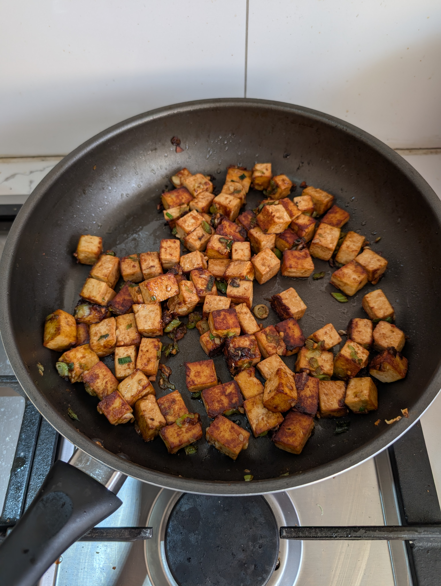

---
tags:
  - protein
aliases: 
category: 
country: 
duration_min: 
todo: false
acknowledgements: 
links: 
theme: tre_light
marp: false
paginate: false
---

# Fried Tofu

|Ingredient|Amount (4 portions)|
| :- | :- |
|tofu|300 g|
|spring onion|4|
|garlic|3 cloves|
|oil|-|
|peanut butter|-|
|salt|-|
|soy sauce|-|
|starch|-|

## Recipe
1. chop **spring onions**, **garlic**
2. press **tofu** block to get liquid out
3. cut **tofu** into cubes (1cm)
4. marinade **tofu**
	1. add to bowl
	2. add **oil**, **soy sauce**, **salt**
	3. mix well
	4. add **starch**
		1. for crunchy crust
5. heat **oil** in pan
6. add **spring onions**
7. add marinated **tofu**
8. optional: add **peanut butter**
9. fry until **tofu**  starts to get gold-brown
10. add **garlic**

## Notes

