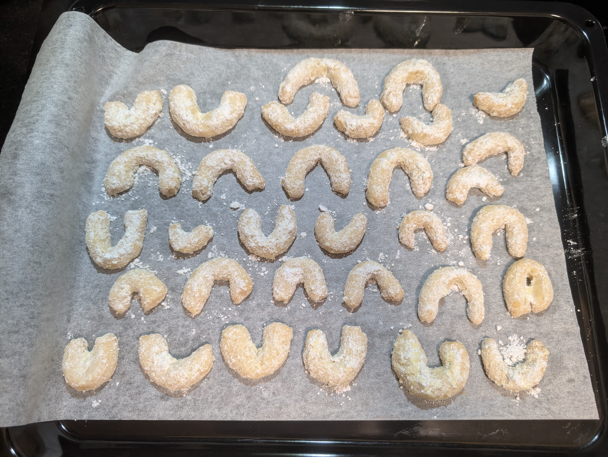
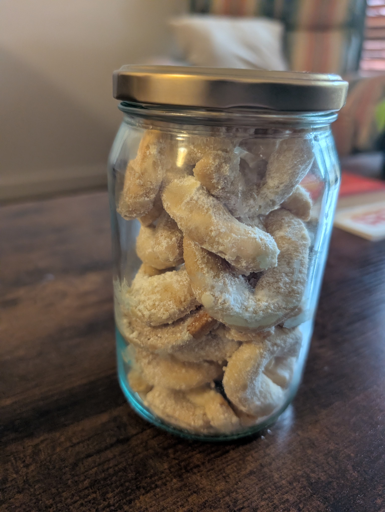
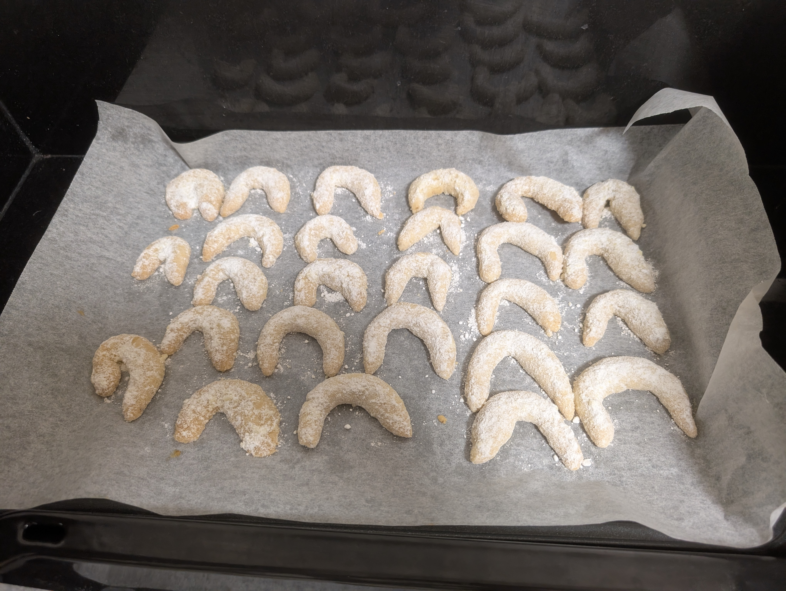

---
tags:
  - baking
  - tradition
  - christmas
aliases:
category:
  - sweet
  - tradition
country:
  - austria
duration_min:
todo: false
acknowledgements:
  - Oma Berni
  - Oma Sylvia
links:
theme: tre_light
marp: false
paginate: false
---

# Vanille Kipferl

|     |     |
| --- | --- |
|||

|Ingredient|Amount (90 Kipferl)|Alternative Units|
| :- | :- | :- |
|flour|300 g|
|butter|250 g|
|sugar (icing)|150 g|
|almonds|100 g|
|sugar|70 g|
|milk|45 mL|
|vanilla sugar|10 g|
|salt|1 pinch|

## Recipe

### Dough
1. cut **butter** in small pieces
	1. **butter** shall at room temperature but not warm (place in fridge for a bit if necessary)
2. mix **flour**, **almonds**, **sugar**, **salt**, **butter**, **milk**
3. knead into dough
 4. make sure that the butter is completely massaged into the dough (otherwise it will stick and/or fall apart when [Shaping the Kipferl](#Shaping%20the%20Kipferl))
5. wrap dough in clingwrap
6. let rest in *fridge* for $\pu{30min}$

### Shaping the Kipferl
#### Fast but not pretty
1. roll into $\pu{1.5cm}$ diameter cylinders
2. chop into $\pu{5cm}$ long pieces
3. shape into *Kipferl* (horseshoe shape)
4. place on parchment paper

#### Pretty but slow
1. place left hand palm up
2. from the entire dough-batch take about $\pu{cm^3}$ and place it about where the knuckle of your middle finger is
3. repeat until the center of the *Kipferl* is $\approx\pu{0.5cm}$ in diameter
  4. with your flat right hand stroke towards your body applying light pressure
  5. simultaneously the left hand curls slightly
	  1. this ensures that the *Kipferl* doesn't fall apart easily
	   2. this helps in shaping as the centre of the *Kipferl* will be thicker because it is in the valley formed by the muscles of your thumb and pinky
6. place on parchment paper

### Baking
1. preheat oven to $\pu{160^\circ C}$
2. bake for $\pu{15min}-\pu{20min}$
	1. until gold-brown

### Wälz-mixture (coating)
1. mix **sugar (icing)**, **vanilla sugar**
2. while *kipferl* are still warm, place into mixture
	1. be careful, *kipferl* break easily!
3. let cool down completely before placing in container

## Variations

### Oma Sylvia

|Ingredient|Amount (150 Kipferl)|Alternative Units|
| :- | :- | :- |
|flour|360 g|
|butter|280 g|
|sugar (icing)|290 g|
|walnuts|140 g|
|vanilla sugar|10 g|
|salt|1 pinch|

#### Dough
1. grate **walnuts**
2. cut **butter** in small pieces
	1. **butter** shall COLD (place in fridge for a bit if necessary)
3. mix **flour**, **walnuts**, $\pu{140g}$ **sugar (icing)**, **salt**, **butter**
4. knead into dough
 5. make sure that the butter is completely massaged into the dough (otherwise it will stick and fall apart when rolling)
6. wrap dough in clingwrap
7. let rest in *fridge* for $\ge\pu{30min}$
10. [Shaping the Kipfer](#shaping-the-kipferl)
11. place on parchment paper
12. preheat oven to $\pu{160^\circ C}$
13. bake for $\pu{15min}-\pu{20min}$
	1. until gold-brown

### Wälz-mixture (coating)
1. mix $\pu{150g}$ **sugar (icing)**, **vanilla sugar**
2. while *kipferl* are still warm, place into mixture
	1. be careful, *kipferl* break easily!
3. let cool down completely before placing in container

## Notes
* you can use **sugar (icing)** instead of **sugar**
* some recipes don't use **milk** at all