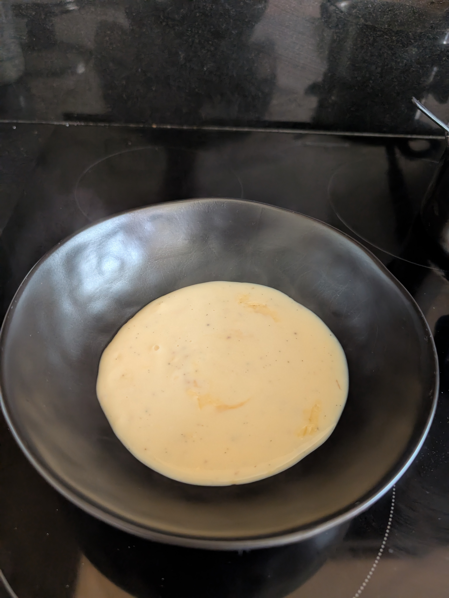
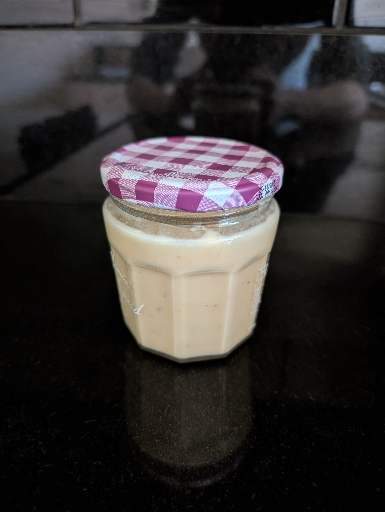

---
tags:
  - sweet
  - sauce
category:
  - cooking
country:
duration_min:
todo: false
theme: tre_light
marp: false
paginate: false
aliases:
acknowledgements:
links:
  - https://www.einfachbacken.de/rezepte/vanillesosse-schmeckt-wie-bei-oma
---

# Vanilla Sauce

|     |     |
| :-: | :-: |
|||

|Ingredient|Amount (4 portions)|
| :- | :- |
|milk|500 mL|
|sugar|50 g|
|starch (corn)|15 g|
|egg|2|
|vanilla bean|0.5|

## Recipe
### The Base
2. mix $\frac{1}{3}$ of **milk** with with **eggyolk**, **sugar**, **starch (corn)**
3. extract seeds from **vanilla bean**
	1. add to mixture

### The Sauce
2. boil $\frac{2}{3}$ of **milk** in pot
3. as soon as **milk** boiled
	1. stir in  [The Base](#The%20Base)
4. keep stirring until the mixture boils up once again

## Notes
* stays edible for at least 3 days in fridge

