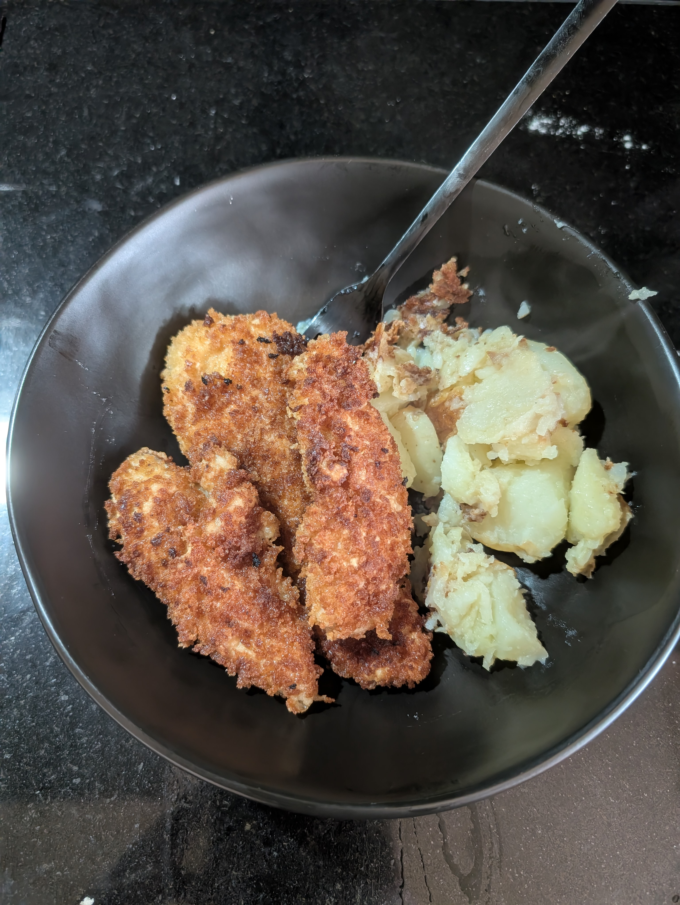

---
tags:
  - meat
category:
  - cooking
country:
  - austria
duration_min:
todo: false
theme: tre_light
marp: false
paginate: false
aliases:
acknowledgements:
links:
  - https://www.gutekueche.at/wiener-schnitzel-rezept-170
---

# Wiener Schnitzel

|Ingredient|Amount (4 portions)|Alternative Units|
| :- | :- | :- |
|veil schnitzel|640g|4 schnitzel|
|breadcrumb|300g|
|flour|150g||
|egg|2||
|cling wrap|0|z|
|oil|0mL||
|salt|4pinch||

## Recipe
### Prep
1. place **veil schnitzel** between **cling wrap**
2. beat until somewhat flat
3. sprinkle **salt** on both sides of each **schnitzel**

### Panierstrasse
1. prepare
	1. 1 plate with **flour** (A)
	2. 1 soup-plate with **egg** mixed well (B)
	3. 1 plate with **breadcrumbs** (C)
2. drag each **schnitzel** through A-C
	1.   make sure everything is covered

### Frying
1. heat **oil** in pan
	1. about half as much as **schnitzel** are high
	2. make sure the oil is very hot
2. slightly reduce heat
3. add **schnitzel** and fry on both sides until gold-brown
	1. shake pan a little to ensure even frying
4. once done place on plate with **paper towels** to let oil drop off

## Sides
* [Potato_ButterAndParsley](Potato_ButterAndParsley.md)
* [Potato_Roasted](Potato_Roasted.md)

## Notes
* usually served with
	* a slice of **lemon** to drizzel atop
	* a little bit of **cranberry jam**
* you can also use **chicken breast** instead of **veil schnitzel**
	* the original Wiener Schnitzel is, however, a protected term and can only be used with **veil**
	* everything else is *Schnitzel Wiener Art*
